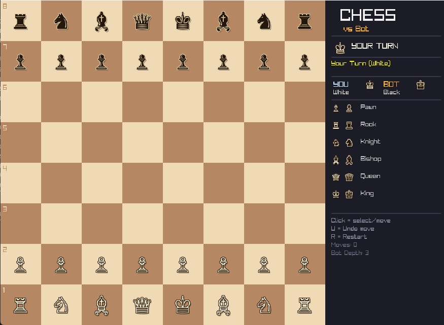

# ♟️ Chess Game — C++ OOP + Raylib + Minimax AI

A complete **Chess Game developed in C++** using **Object-Oriented Programming (OOP)** and **Raylib**, featuring an AI opponent powered by **Minimax with Alpha-Beta Pruning**.

This project was developed as an OOP-focused implementation of a playable chess game, combining software design principles, chess rules, graphical programming, and artificial intelligence.



---

## 🎮 Features

* ♟️ Player vs AI gameplay
* 🤖 Minimax-based Chess AI
* ✂️ Alpha-Beta Pruning
* ♜ Complete chess piece movement
* 👑 Check and Checkmate detection
* 🤝 Stalemate detection
* 🔄 Castling — King-side & Queen-side
* ⚔️ En Passant
* 👸 Pawn Promotion to Queen
* ↩️ Undo Move
* 🔄 Restart Game
* 💡 Legal Move Highlighting
* 🔴 Check Indicator
* 🖱️ Mouse-based controls
* 🧵 Multithreaded AI processing
* 🎨 Graphical interface using Raylib

---

## 🧱 OOP Concepts Used

This project demonstrates several important C++ Object-Oriented Programming concepts.

### 1. Abstraction

`Piece` is implemented as an **abstract base class** containing pure virtual functions such as:

```cpp
virtual std::vector<Move> getValidMoves(...) const = 0;
```

### 2. Inheritance

Individual chess pieces inherit from the `Piece` base class:

```text
Piece
├── Pawn
├── Knight
├── Bishop
├── Rook
├── Queen
├── King
└── EmptyPiece
```

### 3. Polymorphism

Each derived piece implements its own version of:

```cpp
getValidMoves()
```

allowing the board to work with different piece types through the common `Piece` interface.

### 4. Encapsulation

Piece properties such as:

* Piece type
* Side
* Movement state

are managed through class members and getters/setters.

### 5. Operator Overloading

The project overloads:

```cpp
operator==()
operator!=()
```

for comparing pieces and moves.

### 6. Constructors & Destructors

Constructors and destructors are implemented across the class hierarchy to properly manage objects and resources.

### 7. Exception Handling

An `InvalidMoveException` class is used to handle invalid chess moves.

### 8. STL Containers

The project uses STL containers including:

```cpp
std::vector
std::stack
```

### 9. Lambda Functions

Lambda expressions are used during move generation for helper operations such as board-boundary checking and sliding movement.

---

## 🤖 AI — Minimax + Alpha-Beta Pruning

The Black player is controlled by an AI bot using the **Minimax algorithm**.

The AI evaluates possible moves recursively and selects the move that maximizes its position while assuming the opponent will play optimally.

### Search Configuration

```text
Bot Depth: 3
```

Alpha-Beta Pruning is used to eliminate branches of the game tree that do not need to be evaluated, improving the efficiency of the Minimax search.

The evaluation function considers:

* Piece values
* Pawn positional values
* Material advantage

---

## ♟️ Chess Rules Implemented

The game supports the following chess mechanics:

| Rule            | Supported |
| --------------- | --------- |
| Pawn Movement   | ✅         |
| Knight Movement | ✅         |
| Bishop Movement | ✅         |
| Rook Movement   | ✅         |
| Queen Movement  | ✅         |
| King Movement   | ✅         |
| Capturing       | ✅         |
| Check           | ✅         |
| Checkmate       | ✅         |
| Stalemate       | ✅         |
| Castling        | ✅         |
| En Passant      | ✅         |
| Pawn Promotion  | ✅         |

---

## 🎮 Controls

| Input          | Action              |
| -------------- | ------------------- |
| 🖱️ Left Click | Select / Move Piece |
| `U`            | Undo Move           |
| `R`            | Restart Game        |

---

## 🏗️ Project Architecture

```text
Chess Game
│
├── Piece (Abstract Base Class)
│   ├── Pawn
│   ├── Knight
│   ├── Bishop
│   ├── Rook
│   ├── Queen
│   ├── King
│   └── EmptyPiece
│
├── Board
│   ├── Board State
│   ├── Move Generation
│   ├── Legal Move Validation
│   ├── Check Detection
│   └── Move Execution
│
├── AI
│   ├── Position Evaluation
│   ├── Minimax
│   └── Alpha-Beta Pruning
│
└── Game
    ├── User Input
    ├── Game State
    ├── Undo System
    ├── AI Thread
    └── Raylib Rendering
```

---

## 🧰 Technologies Used

* **C++**
* **Raylib**
* **Object-Oriented Programming**
* **Minimax Algorithm**
* **Alpha-Beta Pruning**
* **STL**
* **Multithreading**

---

## ⚙️ Requirements

Before running the project, make sure you have:

* C++ compiler
* Raylib
* Windows environment with the required Raylib setup
* A font containing chess Unicode symbols

The current implementation loads the chess symbols from the Windows **Segoe UI Symbol** font and falls back to Arial if necessary.

---

## 🚀 How to Run

### 1. Clone the Repository

```bash
git clone https://github.com/YOUR_USERNAME/Chess-Game-Cpp.git
cd Chess-Game-Cpp
```

### 2. Configure Raylib

Make sure Raylib is correctly installed and linked with your C++ compiler.

### 3. Compile

Compile `main.cpp` with your Raylib configuration.

### 4. Run

Launch the generated executable and start playing.

---

## 👥 Authors

**Syed Muhammad Haider Naqvi**
**Syed Khurram Abbas Rizvi**

---

## 📚 Project Focus

This project focuses on applying **Object-Oriented Programming concepts in a practical application** rather than implementing chess as a collection of simple procedural functions.

It combines:

```text
OOP
 +
Data Structures
 +
Algorithms
 +
Artificial Intelligence
 +
Graphics Programming
 =
Chess Game
```

---

⭐ If you found this project interesting, consider giving the repository a star!
